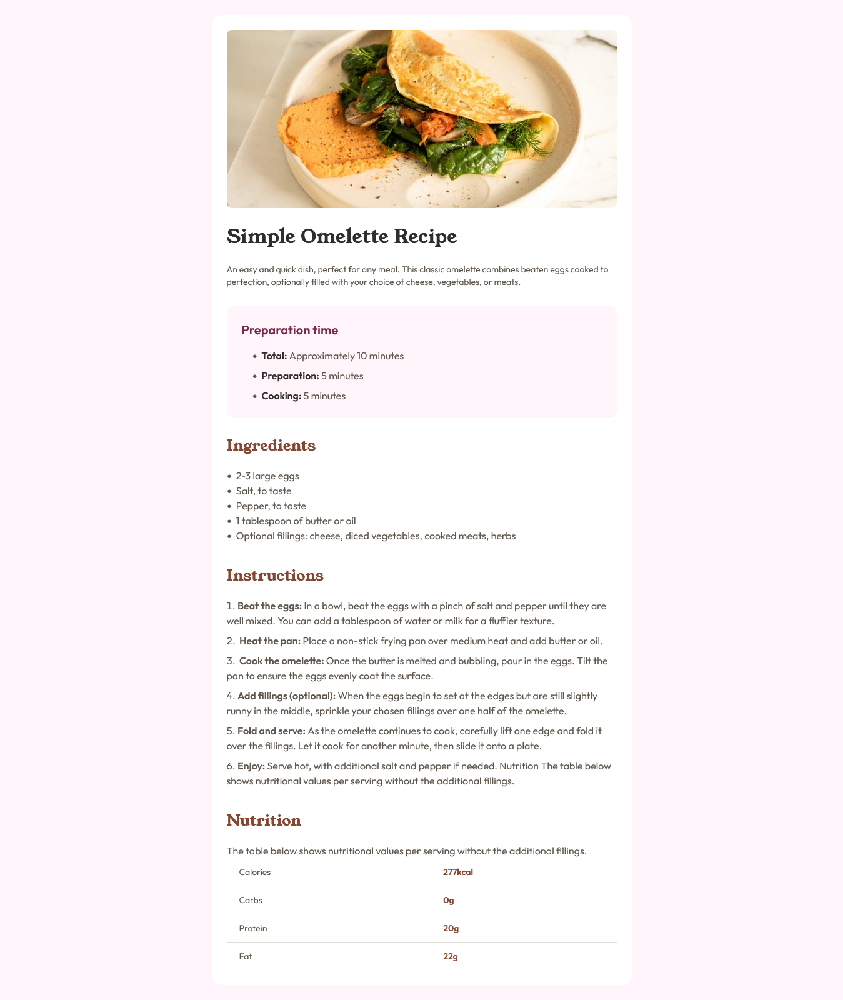

# Frontend Mentor - Recipe page solution

This is a solution to the [Recipe page challenge on Frontend Mentor](https://www.frontendmentor.io/challenges/recipe-page-KiTsR8QQKm). Frontend Mentor challenges help you improve your coding skills by building realistic projects.

## Table of contents

- [Overview](#overview)
  - [The challenge](#the-challenge)
  - [Screenshot](#screenshot)
  - [Links](#links)
- [My process](#my-process)
  - [Built with](#built-with)
  - [What I learned](#what-i-learned)
- [Author](#author)
- [Acknowledgments](#acknowledgments)

## Overview

### Screenshot



### Links

- Solution URL: [github](https://www.github.com/oloude)

## My process

### Built with

- Semantic HTML5 markup
- CTailwind
- Flexbox
- Mobile-first workflow
- [React](https://reactjs.org/) - JS library

### What I learned

Use this section to recap over some of your major learnings while working through this project. Writing these out and providing code samples of areas you want to highlight is a great way to reinforce your own knowledge.

To see how you can add code snippets, see below:

```js
function Hero() {
  return (
    <div className="mb-7">
      
      <h1 className="text-3xl font-Young_Serif font-bold text-stone900 mb-6 px-6 sm:px-0">
        Simple Omelette Recipe{" "}
      </h1>
      <p className="text-sm text-stone800 px-6 sm:px-0">
        An easy and quick dish, perfect for any meal. This classic omelette
        combines beaten eggs cooked to perfection, optionally filled with your
        choice of cheese, vegetables, or meats.
      </p>
    </div>
  );
}
```

## Author

- Frontend Mentor - [@Oloude](https://www.frontendmentor.io/profile/oloude)
- Twitter - [@AbosedeOloude](https://www.twitter.com/AbosedeOloude)
